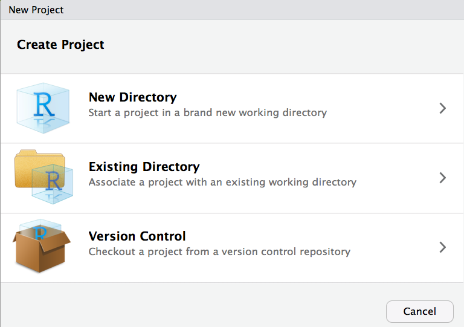
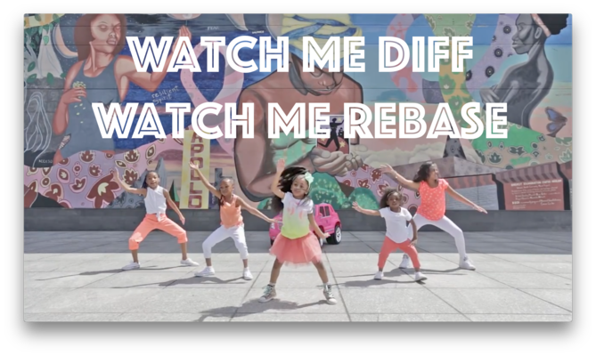
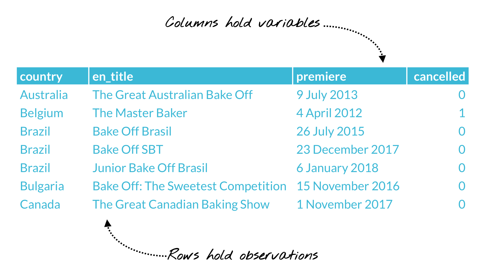
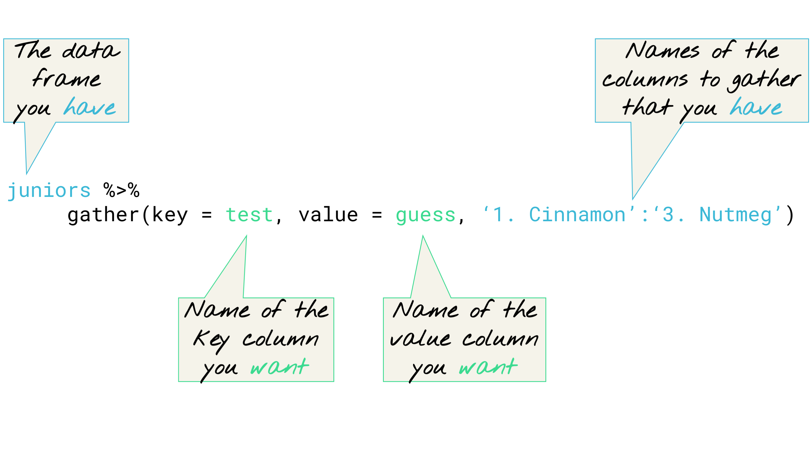

```{r setup, include=FALSE}
knitr::opts_chunk$set(warning = FALSE, message = FALSE)
library(tidyverse)
```

# Introduction

* R is an interpreter `>`
* Object-oriented `<-`
* Case matters (`i_like_snake_case`)
* Anything behind a `#` is a comment
* Packages! Install once per machine, once per R session

**Install once** per machine

```{r eval = FALSE}
install.packages("tidyverse") # yes in quotes
```

**Load once** per R work session
```{r eval = FALSE}
library(tidyverse) # no no quotes
```


Overriding conflicts
```{r}
select <- dplyr::select
```

Get help
```{r}
?select
```

You can also get packages that are available on GitHub (may be development versions of what is on CRAN)
```{r eval = FALSE}
install.packages("devtools")
devtools::install_github("gadenbuie/ggpomological", build_vignette = TRUE)
library(ggpomological) # load like any other package
```

## RStudio

* Recommended IDE. 

* Download open source desktop version: https://www.rstudio.com/products/rstudio/

* Use Projects! https://support.rstudio.com/hc/en-us/articles/200526207-Using-Projects 



* Use Projects + Git in RStudio: http://happygitwithr.com



## Tidyverse

What is it?
https://www.tidyverse.org


Piping/chaining with the `%>%` operator

- With the pipe, think "data frame first, data frame once"

Problem:

Nesting your dataframe in commands is hard to read

```{r}
head(iris)
```

Solution:

Piping your dataframe into a command lets you read L to R

```{r}
iris %>% head(.)
```

Without the pipe, sequences of commands are read inside out

```{r}
head(iris[iris$Species == "virginica", ])
```

Chaining your commands lets you read L to R

```{r}
iris %>% filter(Species == "virginica") %>% head(.) 
```

# Reading data



- Recommendation: `readr` package
- Loaded in the `tidyverse` bundle. 
- Benefits over other base import functions:
    * Faster
    * Automated sensible defaults 
    * Sensible detection of variable types

We don't need this as it loaded in the `tidyverse` package for us but a reminder...

```{r eval = FALSE}
install.packages("readr") # once per machine
library(readr) # once per work session
```


Read in from a url

Our data is stored in a gist:
https://gist.github.com/kylebgorman/77ce12c9167554ade560af9d34565c11

I saved the raw url as a human-readable link.

```{r}
mazes <- read_csv("http://bit.ly/mazes-gist")
```


Problem: File paths are hard

Solution: Use `here::here`

```{r}
library(here)
mazes <- read_csv(here("data", "mazes.csv")) # from readr
glimpse(mazes) # from dplyr
```

Problem: Variable types are hard

Solution: Use `readr::read_csv(col_types)`

```{r}
mazes <- read_csv(here("data", "mazes.csv"), 
                  col_types = cols(
                    DX = col_factor(levels = NULL),
                    Activity = col_factor(levels = NULL)
                    )
                  ) 
glimpse(mazes) # from dplyr
```

Problem: But I'm a visual person...

Solution: Use `visdat::vis_dat()`

```{r}
library(visdat)
vis_dat(mazes)
```

Problem: Variable names are messy

Solution: Use `janitor::clean_names()`

```{r}
library(janitor)
mazes <- mazes %>% 
  clean_names()
glimpse(mazes)
```

Problem: We want summary statistics for all variables with one line of code 

Solution: Use `skimr::skim()`

```{r}
library(skimr)
skim(mazes)
```

Problem: We need a sanity check for our data

Solution: Count everything

```{r}
mazes %>% tally() # number of rows
mazes %>% distinct(study_id) %>% count() # overall n
mazes %>% 
  summarize(n = n_distinct(study_id))
mazes %>% 
  count(dx, activity) # n by group/activity

# frequency tables
mazes_tab <- mazes %>% 
  tabyl(dx, activity)
mazes_tab
mazes_tab %>% 
  adorn_percentages("col") %>% 
  adorn_pct_formatting() %>% 
  adorn_ns()
```


Other packages for data import in R bundled in `tidyverse`:

* `DBI`, for databases.
* `haven`, for SPSS, SAS and Stata files.
* `httr`, for web apis.
* `jsonlite` for JSON.
* `readxl`, for .xls and .xlsx files.
* `rvest`, for web scraping.
* `xml2`, for XML.

## All together now

If you can, I suggest trying to stay in the tidyverse of packages (at least to start). Recommendations:

* Use RStudio
* Use Projects within RStudio
* Use Git within Projects within RStudio
* Use `readr` to import (or other tidyverse options above)
* Use `readr` to specify column types using `col_types` argument
* Use `visdat::vis_dat()` to visualize column types
* Use `here` for file paths (hurrah!)
* Use `janitor::clean_names()` to clean up variable names
* Use `skimr` to `skim()` all the summary statistics in one line
* Use `dplyr` to count rows (yay for sanity checks)

# Taming data

Five main single-table verbs in `dplyr`:

* `select`: Choose variables/columns by their names
* `filter`: Pick rows based on conditions about their values
* `summarize`: Create summary measures of variables (or groups of observations on variables using `group_by`)
* `mutate`: Make a new variable in the data frame
* `arrange`: Sort the rows based on one or more variables

# Tidying data

The package `tidyr` has two primary functions for tidying data:

* `gather()`
* `spread()`

[`tidyr` tidy data vignette](https://cran.r-project.org/web/packages/tidyr/vignettes/tidy-data.html)

3 rules:

* 1 variable = 1 column
* 1 observation = 1 row
* 1 value = 1 cell



Let's work again with the mazes data.

It is actually already tidy. Why?

```{r}
mazes
glimpse(mazes)
```

It could have been seriously un-tidy...
```{r echo = FALSE}
# make an un-tidy dataset
mazes_longer <- mazes %>% 
  gather(variable_type, maze_count, content:not_cued)
mazes_longer

# unite then spread --> super un-tidy!
mazes_widest <- mazes_longer %>%
  unite(activity_var, activity, variable_type) %>% 
  spread(activity_var, maze_count) 
glimpse(mazes_widest)
```

How could we have fixed this?

```{r}
mazes_step1 <- mazes_widest %>% 
  gather(variable_name, maze_count, -c(study_id, ca, viq, dx))
mazes_step1
mazes_step2 <- mazes_step1 %>% 
  separate(variable_name, into = c("activity", "var_type"), sep = "_") 
mazes_step2
mazes_step3 <- mazes_step2 %>% 
  spread(var_type, maze_count)
mazes_step3
```

Let's do another one...

```{r include = FALSE}
# spread by activity
mazes_wider <- mazes_longer %>% 
  spread(activity, maze_count)
glimpse(mazes_wider)

# spread instead by variable_type (how it was before)
mazes_restored <- mazes_longer %>% 
  spread(variable_type, maze_count)
glimpse(mazes_restored)
```


# Visualizing data

## Scatterplots

```{r}
(plot <- ggplot(mazes, aes(x = content, y = filler)) +
  geom_point())

(plot +
  facet_wrap(~activity))

plot <- ggplot(mazes, aes(x = content, y = filler)) +
  geom_point(alpha = .3) +
  facet_wrap(~activity)
plot

plot <- ggplot(mazes, aes(x = content, y = filler, color = dx)) +
  geom_point(alpha = .5) +
  facet_wrap(~activity)
plot

plot <- ggplot(mazes, aes(x = content, y = filler, color = dx)) +
  geom_point(alpha = .5) +
  facet_wrap(~activity) +
  geom_smooth(se = FALSE)
plot
```

Challenge! 

- Try to change the lines to use the linear model (`lm`) as the smoothing method (function) to use.
- Remove color from the global aesthetics and add `geom_point(aes(color = dx), alpha = .5)`. What changes?

## Distributions

```{r}
ggplot(mazes, aes(x = activity, y = content)) +
  geom_boxplot()

ggplot(mazes, aes(x = activity, y = content)) +
  geom_violin()

ggplot(mazes, aes(x = activity, y = content)) +
  geom_violin(fill = "lightgray", color = NA) +
  geom_boxplot(width = .1, colour = "slateblue", fill = "black")

ggplot(mazes, aes(content)) +
  geom_histogram() +
  facet_wrap(~activity)

ggplot(mazes, aes(content, fill = dx)) +
  geom_density(alpha = .5) +
  facet_wrap(~activity)
```

