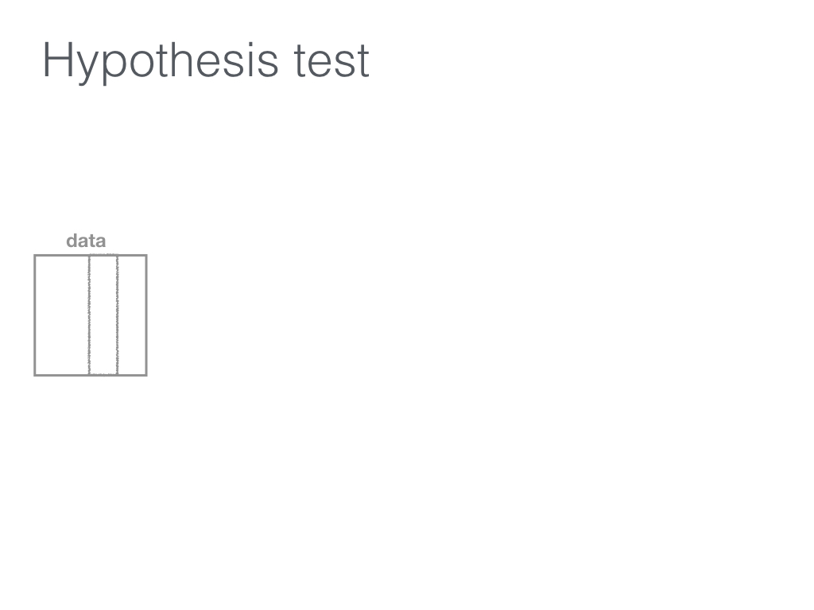
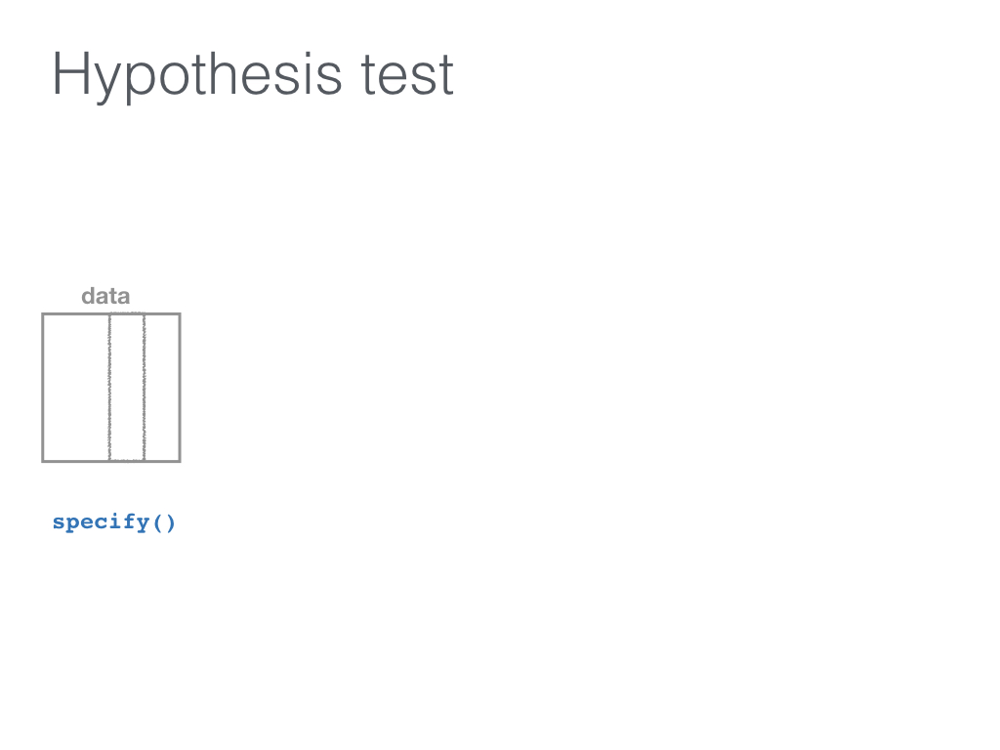
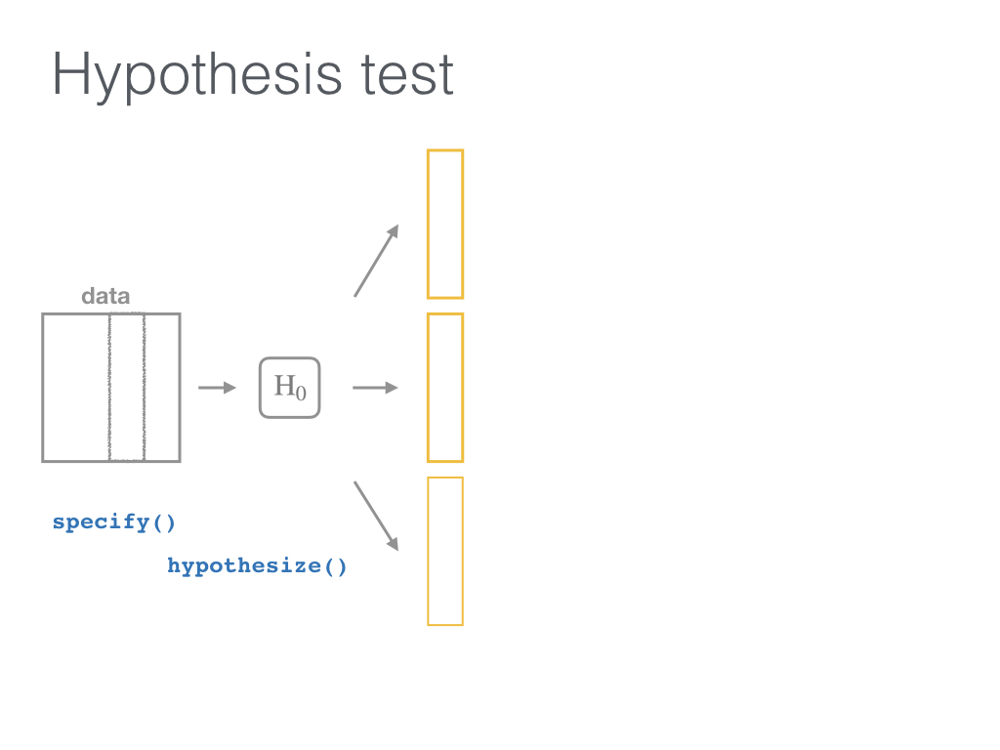
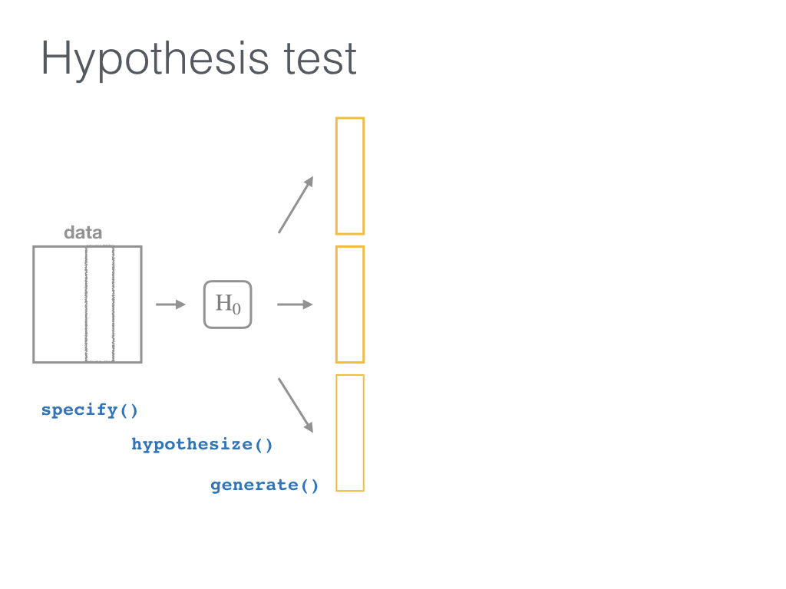
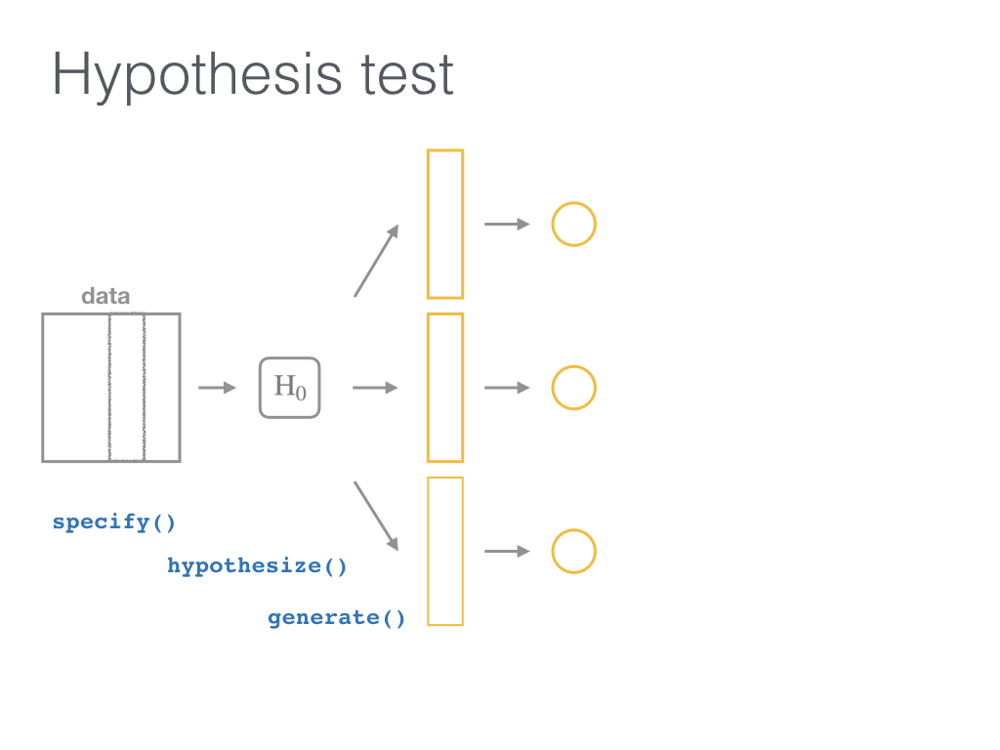
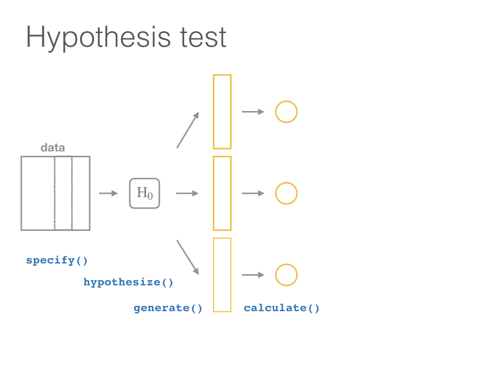
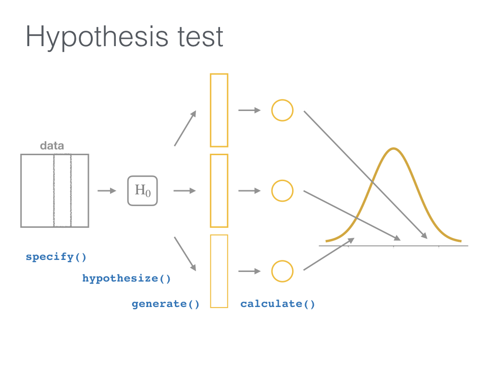

```{r setup, include=FALSE}
options(htmltools.dir.version = FALSE)
knitr::opts_chunk$set(warning=FALSE, message=FALSE, 
  comment=NA,fig.width=10.5, fig.height=4)
```

# Packages

## Install

```{r eval = FALSE}
install.packages("tidyverse")
install.package("infer") # from CRAN
# today I'll use the development version
install.packages("remotes")
remotes::install_github("andrewpbray/infer", ref = "develop")
```

--

## Load

```{r}
library(tidyverse)
library(infer)
library(janitor)
```


---
class: inverse, middle, center

<iframe width = 800px height = 600px src="https://www.youtube.com/embed/M3QYDtSbhrA">
</iframe>

---

# Research Question

If you see someone else yawn, are you more likely to yawn?

In an episode of the show **Mythbusters**, they tested the myth that yawning is contagious. 

---

# Participants and Procedure

--

- $N = 50$ adults who thought they were being considered for an appearance on the show. 

--

- Each participant was interviewed individually by a show recruiter ("confederate") who either
    - yawned, $n = 34$
    - or not, $n = 16$. 

--

- Participants then sat by themselves in a large van and were asked to wait. 

--

- While in the van for some set amount of time (unknown), the Mythbusters watched to see if the unaware participants yawned.


---

# Data

Two group design: 

- $n = 34$ saw the confederate yawn (*seed*)
- $n = 16$ did not see the confederate yawn (*control*)

--

```{r}
group <- c(rep("control", 12), rep("seed", 24), 
            rep("control", 4), rep("seed", 10))
yawn <- c(rep(0, 36), rep(1, 14))

yawn_myth <- data_frame(subj = seq(1, 50), group, yawn) %>% 
  mutate(yawn = as.factor(yawn))

glimpse(yawn_myth)
```


---
class: middle, center

```{r echo = FALSE}
library(DT)
datatable(yawn_myth, options = list(pageLength = 8))
```

---

# Results

```{r}
yawn_myth %>% 
  tabyl(group, yawn) %>% 
  adorn_percentages() %>% 
  adorn_pct_formatting() %>% 
  adorn_ns()
```

---
class: inverse, middle, center

## Conclusion

--

## *Finding: CONFIRMED*<sup>1</sup>

.footnote[
[1] http://www.discovery.com/tv-shows/mythbusters/mythbusters-database/yawning-contagious/]

---

# Really?

> "Though that's not an enormous increase, since they tested 50 people in the field, the gap was still wide enough for the MythBusters to confirm that yawning is indeed contagious."<sup>1</sup>

.footnote[
[1] http://www.discovery.com/tv-shows/mythbusters/mythbusters-database/yawning-contagious/]


---

# State the hypotheses

--

$H_0$:  

> There is no difference between the seed and control groups in the proportion of people who yawned.

--

$H_1$ (directional): 

> More people (relatively) yawned in the seed group than in the control group.

---

# Test the hypothesis

Which type of hypothesis test would you conduct here?

- Independent samples t-test
- Two proportion test
- Chi-square test of independence
- Analysis of Variance
- I don't know!

---

# Test the hypothesis

Which type of hypothesis test would you conduct here?

- Independent samples t-test
- Two proportion test
- Chi-square test of independence
- Analysis of Variance
- I don't know!

--

<br>

***

Answer: 
- Two proportion test


---
class: center, middle

# Two proportion test

--

$H_0: p_{seed} = p_{control}$

--

$H_1: p_{seed} > p_{control}$

---

# The observed difference

```{r}
yawn_myth %>%
  group_by(group) %>%
  summarize(prop = mean(yawn == 1))
```

--

```{r}
(obs_diff <- yawn_myth %>%
  group_by(group) %>%
  summarize(prop = mean(yawn == 1)) %>%
  summarize(diff(prop)) %>%
  pull())
```


---
class: inverse, middle, center

## Is this difference *meaningful*?

--

## Different question: 

--

## Is this difference *significant*?

---

# Modeling the null hypothesis

If... 

$$H_0: p_{seed} = p_{control}$$

is true, then whether or not the participant saw someone else yawn does not matter: there is no association between exposure and yawning.


---
class: inverse, center, middle


---


.pull-left[
### Original universe

```{r echo = FALSE}
yawn_myth %>% 
  slice(c(1:6, 15:20))
yawn_myth %>% 
  tabyl(group, yawn) %>% 
  adorn_totals(where = c("row", "col"))
```
]

--

.pull-right[
### Parallel universe
```{r echo = FALSE}
set.seed(8)
perm1 <- yawn_myth %>% 
  specify(formula = yawn ~ group,
           success = "1") %>% 
  hypothesize(null = "independence") %>% 
  generate(reps = 1, type = "permute") %>% 
  ungroup() %>% 
  mutate(subj = seq(1,50)) %>% 
  select(subj, group, alt_yawn = yawn) 
perm1 %>% 
  slice(c(1:6, 15:20))
perm1 %>% 
  tabyl(group, alt_yawn) %>% 
  adorn_totals(where = c("row", "col"))
```
]

---

# 1000 parallel universes

.pull-left[
```{r echo=FALSE}
yawn_universes <- yawn_myth %>% 
  specify(yawn ~ group,
          success = "1") %>% 
  hypothesize(null = "independence") %>% 
  generate(reps = 1000, type = "permute") %>% 
  calculate(stat = "diff in props", 
            order = c("seed", "control"))
yawn_universes
```
]

--

.pull-right[
```{r echo=FALSE}
yawn_universes %>% 
  slice(990:1000)
```
]

---
## The parallel universe distribution

```{r echo=FALSE}
set.seed(8)
null_distn <- yawn_myth %>% 
  specify(formula = yawn ~ group,
          success = "1") %>% 
  hypothesize(null = "independence") %>% 
  generate(reps = 1000, type = "permute") %>% 
  calculate(stat = "diff in props", 
            order = c("seed", "control"))
null_plot <- null_distn %>% 
  visualize(., bins = 10) +
  geom_vline(xintercept = obs_diff, color = "dodgerblue", size = 2) +
  labs(x = "Difference in proportions") +
  coord_cartesian(xlim = c(-.5, .5), ylim = c(0, 260)) +
  geom_rect(aes(xmin = obs_diff, xmax = .5, ymin = 0, ymax = 130), 
            fill = "dodgerblue", 
            alpha = 0)
null_plot
```


The distribution of 1000 differences in proportions, if the null hypothesis were *true* and yawning was not contagious. 

In how many of our "parallel universes" is the difference as big or bigger than the one we observed (`r obs_diff`)?


---
## Calculating the p-value

```{r echo = FALSE}
null_plot +
  geom_rect(aes(xmin = obs_diff, 
                xmax = Inf, 
                ymin = 0, 
                ymax = Inf), 
            fill = "dodgerblue", 
            alpha = .007)
```

That proportion is the p-value!

```{r echo = FALSE}
null_distn %>% 
  summarize(n_as_big = sum(stat >= obs_diff),
            n_total = n(),
            p_value = mean(stat >= obs_diff))
```

---
class: middle, center


[](http://allendowney.blogspot.com/2016/06/there-is-still-only-one-test.html)

---

class: inverse, center, middle

# The tidy way

# Use the infer package


---



<small>https://github.com/ismayc/talks/tree/master/data-day-texas-infer</small>
---


<small>https://github.com/ismayc/talks/tree/master/data-day-texas-infer</small>

---


<small>https://github.com/ismayc/talks/tree/master/data-day-texas-infer</small>

---


<small>https://github.com/ismayc/talks/tree/master/data-day-texas-infer</small>
---



<small>https://github.com/ismayc/talks/tree/master/data-day-texas-infer</small>
---



<small>https://github.com/ismayc/talks/tree/master/data-day-texas-infer</small>
---



<small>https://github.com/ismayc/talks/tree/master/data-day-texas-infer</small>
---


<small>https://github.com/ismayc/talks/tree/master/data-day-texas-infer</small>

---



<small>https://github.com/ismayc/talks/tree/master/data-day-texas-infer</small>
---


<small>https://github.com/ismayc/talks/tree/master/data-day-texas-infer</small>
---


<small>https://github.com/ismayc/talks/tree/master/data-day-texas-infer</small>

---

# `infer`

5 functions:

- `specify()`
- `hypothesize()`
- `generate()`
- `calculate()`
- `visualize()`

---

# `infer`

- `specify` the response and explanatory variables (`y ~ x`)
- `hypothesize` what the null $H_0$ is (here, `independence` of `y` and `x`)
- `generate` new samples from parallel universes:
    - Resample from our original data **without replacement**, each time shuffling the `group` (`type = "permute"`)
    - Do this **a ton of times** (`reps = 1000`)
- `calculate` the *new* statistic (`stat = "diff in props"`) for each `rep`


```{r eval = FALSE}
set.seed(8)
null_distn <- yawn_myth %>% 
  specify(formula = yawn ~ group, success = "1") %>% 
  hypothesize(null = "independence") %>% 
  generate(reps = 1000, type = "permute") %>% 
  calculate(stat = "diff in props", order = c("seed", "control"))
```

---

# Visualize the null distribution

- `visualize` the distribution of the `stat` (here, `diff in props`)

```{r echo = FALSE}
null_plot
```


```{r eval = FALSE}
visualize(null_distn, bins = 10) +
  geom_vline(xintercept = obs_diff, 
             color = "dodgerblue",
             size = 2) 
```


---

# Classical inference

Rely on theory to tell us what the null distribution looks like. 

```{r}
yawn_myth %>%
  specify(yawn ~ group, success = "1") %>%
  hypothesize(null = "independence") %>% 
  # generate() is not needed since we are not doing randomization
  # calculate(stat = "z") is implied based on variable types
  visualize(method = "theoretical")  +
  geom_vline(xintercept = obs_diff, color = "dodgerblue", size = 2) 
```


---
# Classical vs resampling

Changed the `stat` to calculate to `z` now (before we did `diff in props`). 

```{r}
yawn_myth %>%
  specify(yawn ~ group, success = "1") %>%
  hypothesize(null = "independence") %>% 
  generate(reps = 1000, type = "permute") %>% 
  calculate(stat = "z", order = c("seed", "control")) %>% 
  visualize(method = "both", bins = 10) +
  geom_vline(xintercept = obs_diff, color = "dodgerblue", size = 2) 
```

---

# Do the test in R

```{r}
yawn_table <- table(group, yawn)
yz <- prop.test(x = yawn_table, n = nrow(yawn_myth),
          alternative = "greater", correct = FALSE) 
yz
```

--

What does this test assume?

---

# In class exercise

- Read in the `mazes` data (http://bit.ly/mazes-gist)

- Use `dplyr::filter` to include only two groups (`dx`).

- Use `infer` to compare a numerical variable between the two groups using:
    - A permutation test and
    - A classical theoretical test.

---

class: center, middle

# Thanks!

Slides created via the R package [**xaringan**](https://github.com/yihui/xaringan).

